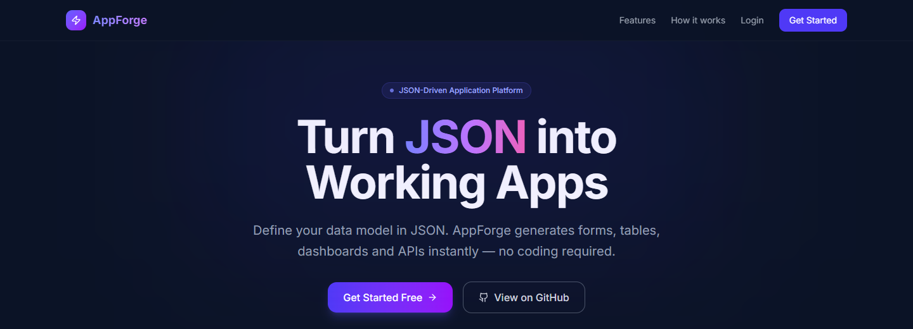
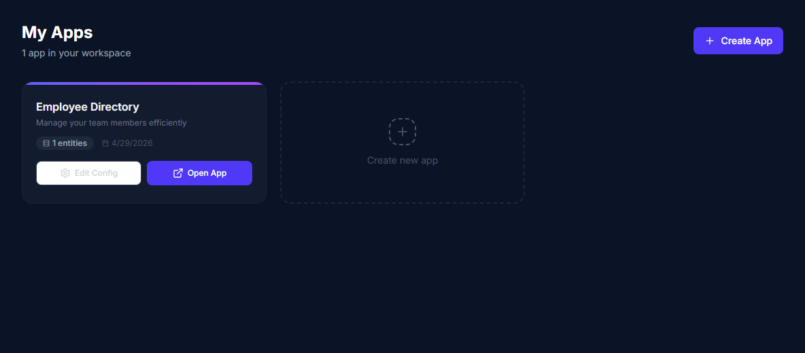
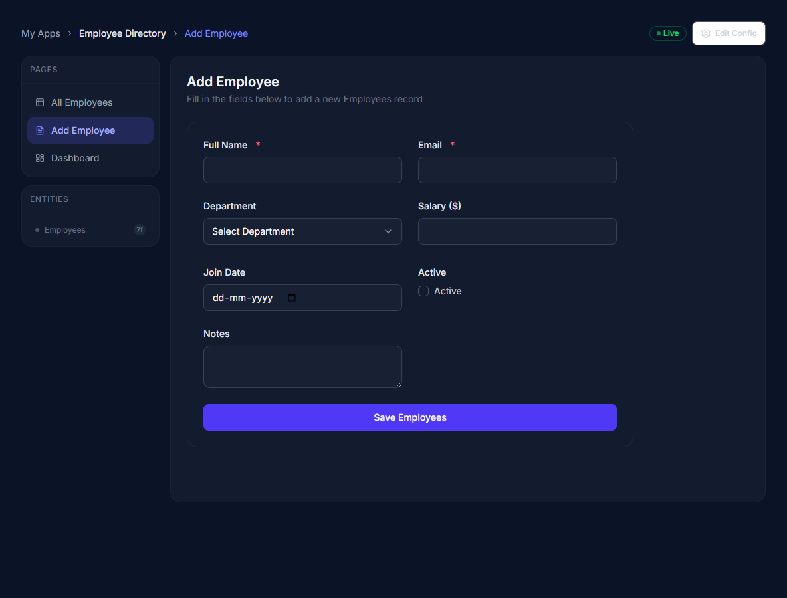
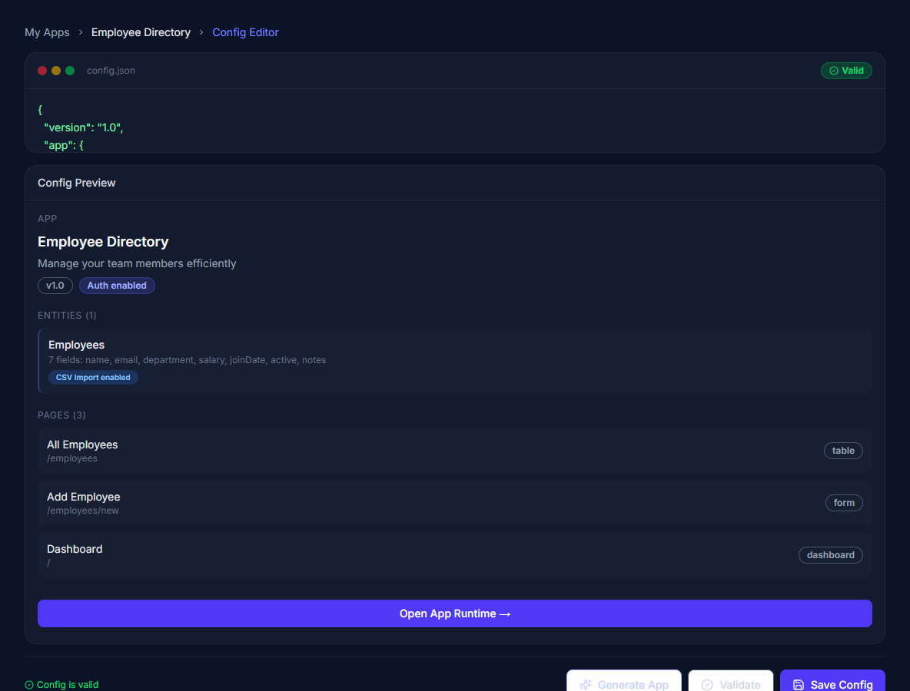

# AppForge

AppForge is a JSON-driven mini app generator built with Next.js. Define an app schema once, then AppForge renders authenticated workspaces, generated forms, data tables, dashboards, CSV import flows, and dynamic API endpoints around that configuration.

**Languages Used:** TypeScript, TSX, CSS, Prisma Schema, JSON, and JavaScript.

The project ships with a seeded Employee Directory example so the runtime experience can be tested immediately after setup.



## Screenshots

### Workspace dashboard



### Generated form runtime



### JSON config editor



## Features

- JSON-based app configuration for entities, fields, pages, roles, and dashboard components.
- Generated CRUD experiences with table, form, dashboard, landing, and game page types.
- Dynamic forms powered by React Hook Form and Zod-style field validation rules.
- Data tables with search, pagination-ready structure, edit/delete actions, and CSV import support.
- Config editor with JSON validation, warning/error feedback, and a live structured preview.
- Authentication with NextAuth credentials and optional GitHub OAuth.
- Prisma-backed persistence with a local SQLite development database.
- Seeded demo workspace for fast local testing.

## Tech Stack

| Area | Tools |
| --- | --- |
| Framework | Next.js 15, React 19, TypeScript |
| Styling | Tailwind CSS 4, Radix UI primitives, Lucide React |
| Auth | NextAuth.js, Prisma adapter, bcryptjs |
| Database | Prisma ORM, SQLite for local development |
| Forms and validation | React Hook Form, Zod |
| Data import | Papa Parse |
| Charts | Recharts |

## Project Structure

```text
appforge/
  prisma/
    schema.prisma        # Prisma models for users, apps, sessions, and entity data
    seed.ts              # Demo user, demo app, and Employee Directory seed data
  public/
    screenshots/         # README screenshots captured from the actual app
  src/
    app/                 # Next.js App Router pages and API routes
    components/layout/   # Authenticated app shell and sidebar
    components/runtime/  # Generated forms, tables, dashboards, CSV import, renderer
    components/ui/       # Shared UI primitives
    lib/                 # Auth, Prisma, config validation, runtime helpers
    types/               # App config and runtime data types
```

## Getting Started

### Prerequisites

- Node.js 18 or newer
- npm

### 1. Clone the repository

```bash
git clone https://github.com/Trunal2005/mini-app-generator.git
cd mini-app-generator
```

### 2. Install dependencies

```bash
npm install
```

### 3. Configure environment variables

Create a local environment file:

```bash
cp .env.local.example .env
```

For local SQLite development, make sure these values are set:

```env
DATABASE_URL="file:./dev.db"
NEXTAUTH_SECRET="replace-with-a-long-random-secret"
NEXTAUTH_URL="http://localhost:3000"
```

GitHub OAuth is optional. Add `GITHUB_CLIENT_ID` and `GITHUB_CLIENT_SECRET` only if you want the GitHub sign-in button to be active.

### 4. Prepare the database

```bash
npm run setup
```

This command generates the Prisma client, pushes the schema to the configured database, and seeds the demo workspace. The seed command prints the local demo credentials in the terminal.

### 5. Start the development server

```bash
npm run dev
```

Open [http://localhost:3000](http://localhost:3000) in your browser.

## Available Scripts

| Command | Description |
| --- | --- |
| `npm run dev` | Start the Next.js development server. |
| `npm run build` | Create a production build. |
| `npm run start` | Run the production build. |
| `npm run db:generate` | Generate the Prisma client. |
| `npm run db:push` | Push the Prisma schema to the configured database. |
| `npm run db:seed` | Seed the demo user, demo app, and sample data. |
| `npm run db:studio` | Open Prisma Studio for local database inspection. |
| `npm run setup` | Run generate, push, and seed in sequence. |

## App Configuration Model

Apps are described by a single JSON configuration. The runtime uses this config to render pages and connect them to dynamic entity data.

```json
{
  "version": "1.0",
  "app": {
    "name": "Employee Directory",
    "description": "Manage your team members efficiently",
    "theme": "dark"
  },
  "auth": {
    "enabled": true,
    "roles": ["admin", "viewer"]
  },
  "entities": [
    {
      "name": "employees",
      "label": "Employees",
      "allowCsvImport": true,
      "fields": [
        { "name": "name", "label": "Full Name", "type": "text", "required": true },
        { "name": "email", "label": "Email", "type": "email", "required": true },
        { "name": "department", "label": "Department", "type": "select" }
      ]
    }
  ],
  "pages": [
    { "id": "emp-list", "title": "All Employees", "path": "/employees", "type": "table", "entity": "employees" },
    { "id": "emp-add", "title": "Add Employee", "path": "/employees/new", "type": "form", "entity": "employees" }
  ]
}
```

## Runtime Flow

1. Create or seed an app configuration.
2. AppForge validates and stores the JSON config.
3. The runtime renderer maps page types to generated UI components.
4. Dynamic API routes persist records per app and entity.
5. Users manage data through generated tables, forms, dashboards, and CSV imports.

## Deployment Notes

- Build the app with `npm run build`.
- Set `NEXTAUTH_URL` to the deployed domain.
- Set a strong `NEXTAUTH_SECRET`.
- Configure `DATABASE_URL` for the production database you intend to use.
- If using a non-SQLite database in production, update the Prisma datasource provider accordingly before deploying.

## License

No license file is currently included in this repository.
